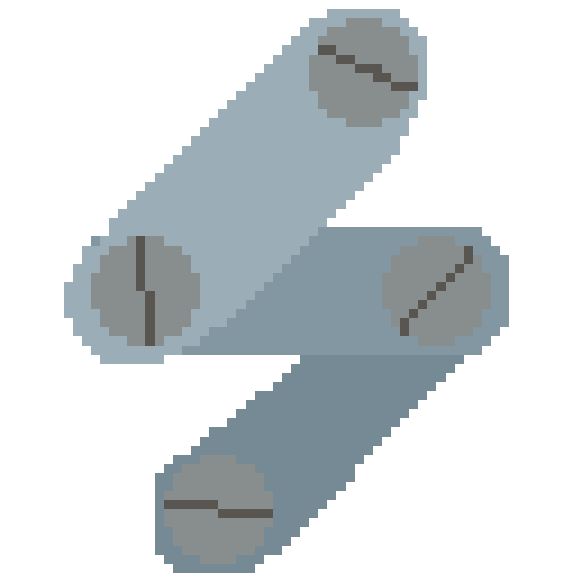

    

<h1 align="center">Sucata</h1>

    Gather yours scraps and recycle into a game!  

    <a href="/Getting%20Started/installation/"> Installation </a>
    <a href="#"> Creating your first project </a>
    <a href="#"> References </a>

    <a href="#"> Examples </a>
    <a target="_blank" href="https://github.com/gumpdev/sucata"> Repository </a>

### Overview

Sucata is a framework to create games using lua, with a simple workflow, relying
just in lua codes.

It designed using OOP on Lua, so works very well with
[classic](https://github.com/rxi/classic)

### Objective

Create a game framework that is simple to use, with a simple workflow, and
lightweight, for developing simple games.
